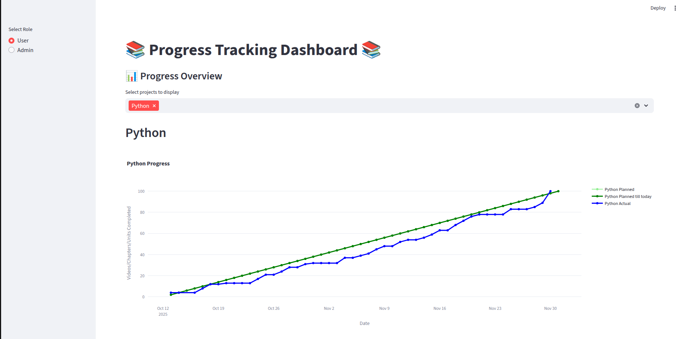
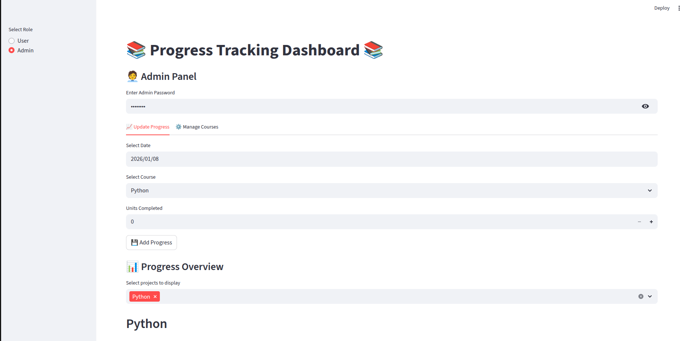

# **Tutorial Progress Tracker**

**A lightweight dashboard for tracking learning progress and goals. The only requirement being the progress and target should be quantified over a period of time. The app visualizes both planned and actual progress over time, supports multiple projects, and provides an interface for data updates.**

#### Built using: **[Streamlit](https://streamlit.io/)**

## **🚀 Features**

* Track multiple courses with:

    * Planned completion trajectory

    * Actual cumulative progress

    * Automated performance visualization

* Course visibility filtering (show/hide specific tracks)

* Configurable per-course parameters:

    * Start date

    * Target days

    * Target videos/pages/units etc.

* Admin update panel for logging progress per day

* Persistent storage via progress.csv

* Cloud deployable via Streamlit Community Cloud

## **🛠️ TO-DO**
1. Data storage and retention through SqLite
2. Email integration through SMTP (Simple Mail Transfer Protocol)

## **📸 UI Preview**

### **User panel**

### **Admin panel**

## **📦 Project Structure**